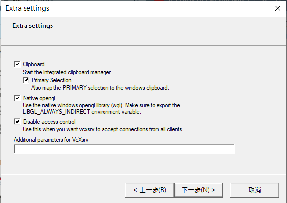

# Overview

This repo provides a comprehensive step-by-step process for setting up a development environment for building micro-ROS utilities using Docker and CubeIDE on Windows Subsystem for Linux (WSL). The setup includes instructions for installing necessary tools like Docker and CubeIDE, configuring CubeIDE with the micro-ROS repository, and establishing a micro-ROS agent.

# Quick Start

1. **Ensure Environment is Set Up:**
   - Copy the package `ak60_commu_test` to your workspace and build it.
   - Copy the project `micro-ros-st-nucleo-f446re_only_commu` to your CubeIDE workspace, build it, and flash it to the F446RE.
   - Install the micro-ROS agent.
   - Attach USB device(F446re) to WSL2

2. **Open X Server and Docker Desktop.**

3. **Start Micro-ROS Agent:**
    ```bash
    ros2 run micro_ros_agent micro_ros_agent serial --dev /dev/ttyACM0
    ```

4. **Run Demo Node:**
    ```bash
    ros2 run ak60_commu_test pub_sub
    ```

https://github.com/user-attachments/assets/b2251c2a-5a29-4e7f-952d-201d4b177d93


# Building Micro-ROS Utilities and Setting Up CubeIDE on WSL

**Key Concept:** Build micro-ROS utilities through Docker → Build STM32 main code base on it

## Prerequisite

1. [Install Docker on Windows](https://learn.microsoft.com/zh-tw/windows/wsl/tutorials/wsl-containers) (Docker Desktop)  
   Use container for compiling ST code.
2. Install CubeIDE in WSL.

## CubeIDE Setup

1. Use [this repo](https://github.com/uhobeike/micro-ros-st-nucleo-f446re?tab=readme-ov-file) as CubeIDE setup sample (e.g., includes, linkers, serial setup, etc.).  
   Official [reference](https://github.com/micro-ROS/micro_ros_stm32cubemx_utils/tree/humble): Section `Using this package with STM32CubeIDE`.
2. **Change `./micro_ros_stm32cubemx_utils` to Humble’s version**

    ```bash
    git clone -b humble https://github.com/micro-ROS/micro_ros_stm32cubemx_utils.git
    ```

3. Launch STM32CubeIDE

    ```bash
    # Every time by absolute path
    /opt/st/stm32cubeide_1.13.2/stm32cubeide

    # Or add an alias in ~/.bashrc
    alias cubeide='sudo /opt/st/stm32cubeide_1.13.2/stm32cubeide'
    cubeide    # Execute
    ```

4. Change permission of workspace (prevent permission denied in CubeIDE building process)

    ```bash
    cd /home/ros2/STM32CubeIDE/workspace_1.13.2/
    sudo chmod -R 777 .
    ```

## Setup Micro-ROS Agent

Official website: [First micro-ROS Application on Linux](https://micro.ros.org/docs/tutorials/core/first_application_linux/)

Step 1-3 only need to be done once.

1. Build `micro_ros_setup`

    ```bash
    # Source the ROS 2 installation
    source /opt/ros/$ROS_DISTRO/setup.bash    # Add to ~/.bashrc

    # Create a workspace and download the micro-ROS tools
    mkdir microros_ws
    cd microros_ws
    git clone -b $ROS_DISTRO https://github.com/micro-ROS/micro_ros_setup.git src/micro_ros_setup

    # Update dependencies using rosdep
    sudo apt update && rosdep update
    rosdep install --from-paths src --ignore-src -y

    # Install pip
    sudo apt-get install python3-pip

    # Build micro-ROS tools and source them
    colcon build
    source ~/microros_ws/install/local_setup.bash    # Add to ~/.bashrc
    ```

2. Firmware was set through Docker.
3. Creating the micro-ROS agent

    ```bash
    # Download micro-ROS-Agent packages
    ros2 run micro_ros_setup create_agent_ws.sh

    # Build step
    ros2 run micro_ros_setup build_agent.sh
    ```

4. **Start running**

    ```bash
    # Run a micro-ROS agent
    ros2 run micro_ros_agent micro_ros_agent serial --dev /dev/ttyACM0
    ```


## Attaching USB Device to WSL2

You need to attach the USB device every time you start WSL2

```bash
# In Windows
# List USB devices
usbipd list

# Under administrator permission
usbipd bind -b <device ID>
usbipd attach --busid <device ID> --wsl
```
```bash
# in wsl
# change permission of usb device in wsl
lsusb
sudo chmod 777 /dev/ttyACM0    # ttyACM1 or others
```

official website: [連線 USB 裝置](https://learn.microsoft.com/zh-tw/windows/wsl/connect-usb)

## Setup X server

[download xserver](https://sourceforge.net/projects/vcxsrv/)
check disable access control



```bash
# copy to ~/.bashrc
export GAZEBO_IP=127.0.0.1
export DISPLAY=$(cat /etc/resolv.conf | grep nameserver | awk '{print $2}'):0 
export LIBGL_ALWAYS_INDIRECT=0
```

# Other Reference
[**ROS 2 Doc: Humble**](https://docs.ros.org/en/humble/index.html)


This project uses code from the repository:

[**micro-ros-st-nucleo-f446re**](https://github.com/uhobeike/micro-ros-st-nucleo-f446re?tab=Apache-2.0-1-ov-file#readme)

Licensed under the [Apache License 2.0](https://opensource.org/licenses/Apache-2.0).

Please refer to the repository for the complete license terms and conditions.
